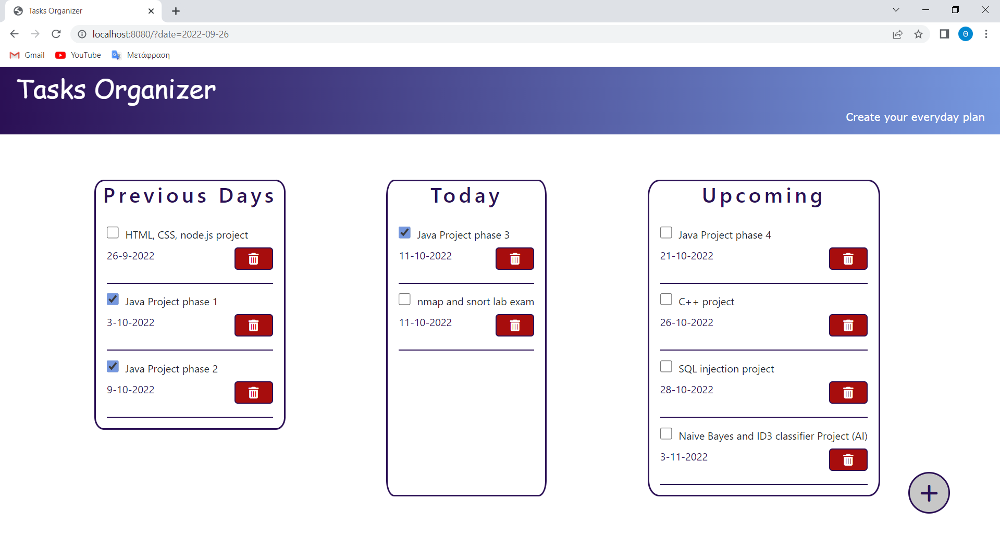
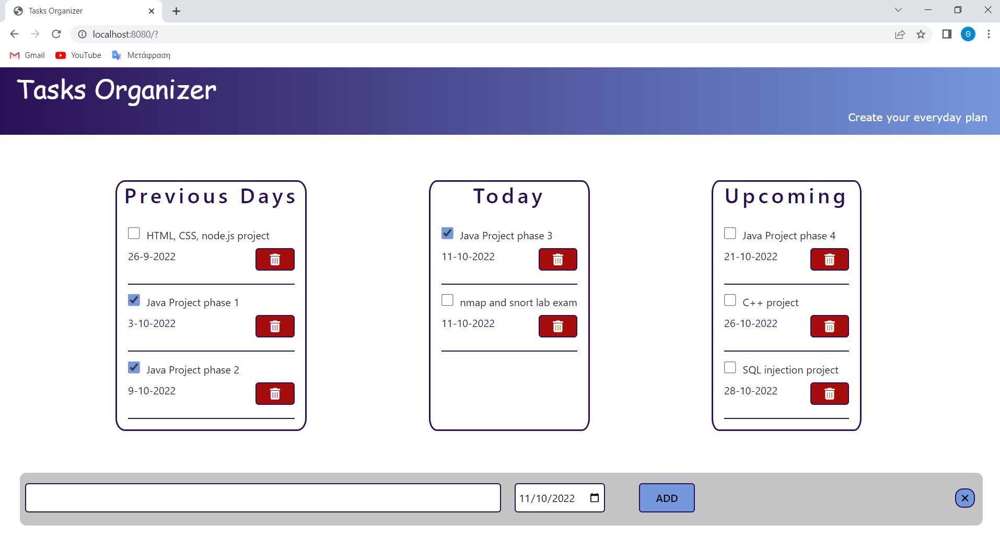
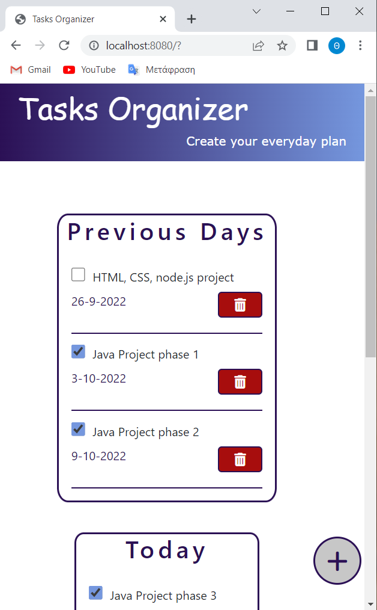

# TasksOrganizer
## About the Project
Tasks Organizer is basically a **to-do list web application**. Tasks Organizer uses  **snowpack bundler** to combine many JavaScript code files into a single one that is production-ready loadable in the browser. I created Task Organizer to learn about **typescript**. The main screen of the project is shown below.  

A user can add a new task by simply press the **plus** button.

Tasks Organizer is also a **responsive** web application. 

## Technologies used in this project
- HTML
- CSS
- Typescript
- Bootstrap

## How to run the project
First you need to install all the project dependencies by typing the command : `npm install` and then to run the project type `npm start`. The web app will run on http://localhost:8080
